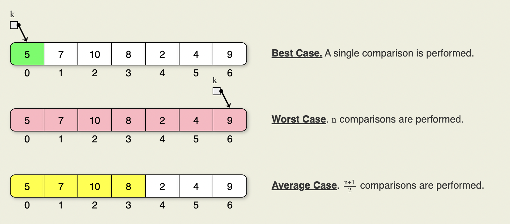

# Algorithm analysis

## Problems, Algorithms and Programs


### Problems
* A problem maps inputs to outputs.
* A problem is a mapping from inputs to outputs, and there might be many algorithms that can accomplish this mapping.


### Programs
* A program is an instantiation of an algorithm implemented in a specific programming language.


### Algorithms
* An algorithm is a series of steps that act as a recipe to solve a particular problem.

#### Comparing algorithms

To estimate an algorithm's performance:
* count the number of basic operations


## Complexity



### Worst-Case

### Average-case

### Best-case

## Order of Growth - Growth Rate

### Big-O Notation

**1. RULES**

*Constant time operations O(1)*

- basic arithmetic operations (e.g., a + b)
- assigning values (e.g., x = 10)
- accessing elements by index (e.g., array[i])

Example: sum = a + b, array[i] = 5.

---
*Linear time operations O(N)*
- Operations that iterate over a lits of elements or list once

Example: For-loop iterating over N elements

* QUADRATIC TIME OPERATIONS O(N^2):
    - Nested for-loops where each loop runs 'n' times
    Example: Bubble sort, insertion sort, selection sort

* CUBIC/POLYNOMIAL TIME OPERATIONS O(n^3)/O(n^k):
    - 3 or more nested for-loops

---
*Logarithmic time operations O(log N)*
    - Divide and conquer algorithms, binary search, operations in balanced binary search trees 
    (e.g. AVL, red-black trees)
    Example: Binary search in a sorted array

---
*Linearithmic time operations O(N log N)*
    - Sorting algorithms like heapsort, mergesort
    Example: sorting an array using merge sort

---
*Exponential time operations O(2^N)*
    - Algorithms where all subsets or combinations are explored
    Example: Recursive algorithms

---
*Factorial time operations O(N!)*
    - Algorithms that generate permutations of a set
    Example: Brute-force algorithms

---
*Applied rates of growth (Heuristics)*

Single loops: usually results in O(N)

Nested loops: Where each loop runs '𝑛' times results in O(n2), O(n3), etc (count the number of nested loops)

Logarithmic loops: Where a problem size is divided in each iteration results in O(log N)

    while n > 1:
        n = n / 2
        # O(1) operation

Different loop bounds: Their complexities should be added, not for nested loops

    for i in range(n):  # O(n)
        # O(1) operation
    for j in range(m):  # O(m)
        # O(1) operation
    # Total: O(n) + O(m)


Non-uniform operations: Operations with different complexities based on certain conditions. Usually, you should only consider the worst-case. 

    for i in range(n):
        if i % 2 == 0:
            # O(1) operation
        else:
            # O(log n) operation
    # Total: O(n * log n) because we consider the worst-case

Conditionals (if-else statements): Depends on the complexity of the operations within them, Usually, you should only consider the branch with the worst-case. 

    if condition:
        # O(n) operation
    else:
        # O(log n) operation
    # Total: O(n) because it's the dominant term


Divide-and-conquer: usually algorithms with O(log N) or O(N log N) complexities

Operations on Data structures: 
* Array/list access: O(1) for accessing elements in index
* Linked list operations: O(N) for search, O(1) for insertion/deletion
* BST: O(log N) for all BST operations
* Hash tables: O(1) for all operations, O(N) for worst-case

Combining complexities: 

* independent operations: add their complexities

    ```
    for i in range(n):  # O(n)
        # O(1) operation
    for j in range(n):  # O(n)
        # O(1) operation
    # Total: O(n) + O(n) = O(n)

* nested operations: multiply their complexities

    ```
    for i in range(n):    # O(n)
        for j in range(n):  # O(n)
            # O(1) operation
    # Total: O(n) * O(n) = O(n^2)

## Asymptotic Complexity

### Algorithmic behaviours and time complexity

#### 1. Constant Time: O(1)
* **Behavior**: The execution time does not depend on the size of the input data. The operations are fixed and do not change as the input size changes.
* **Examples**: Accessing an array element by index, checking if a stack is empty, or assigning a value to a variable.

#### 2. Logarithmic Time: O(log n)
* **Behavior**: The execution time increases logarithmically as the input size increases. This usually occurs in algorithms that divide the problem in half each step or work on reducing the problem size exponentially.
* **Examples**: Binary search in a sorted array, finding an element in a balanced binary search tree.

#### 3. Linear Time: O(n)
* **Behavior**: The execution time increases linearly with the increase in input size. These algorithms typically perform a single operation on each element of the input.
* **Examples**: Summing all elements in an array, checking for the existence of an element in an unsorted list.

#### 4. Linearithmic Time: O(n log n)
* **Behavior**: The execution combines linear and logarithmic behaviors. These are often efficient sorting algorithms that recursively divide and conquer the input.
* **Examples**: Merge sort, quicksort (on average).

#### 5. Quadratic Time: O(n²)
* **Behavior**: The execution time grows as the square of the input size. These algorithms usually involve nested iterations over the data set.
* **Examples**: Bubble sort, insertion sort, checking all pairs in an array (like finding duplicates).

#### 6. Cubic Time: O(n³)
* **Behavior**: The execution time is proportional to the cube of the input size. This is typical in algorithms involving three nested loops.
* **Examples**: Naive algorithms for matrix multiplication, solving three-body problems in physics.

#### 7. Exponential Time: O(2^n)
* **Behavior**: The execution time doubles with each addition to the input size. These algorithms often deal with all possible combinations of inputs.
* **Examples**: Brute-force solutions for the traveling salesman problem, generating all subsets of a set.

#### 8. Factorial Time: O(n!)
* **Behavior**: The execution time grows factorial with the input size. These are algorithms that generate all possible permutations of the input.
* **Examples**: Solving the traveling salesman problem by trying every permutation of visits.

