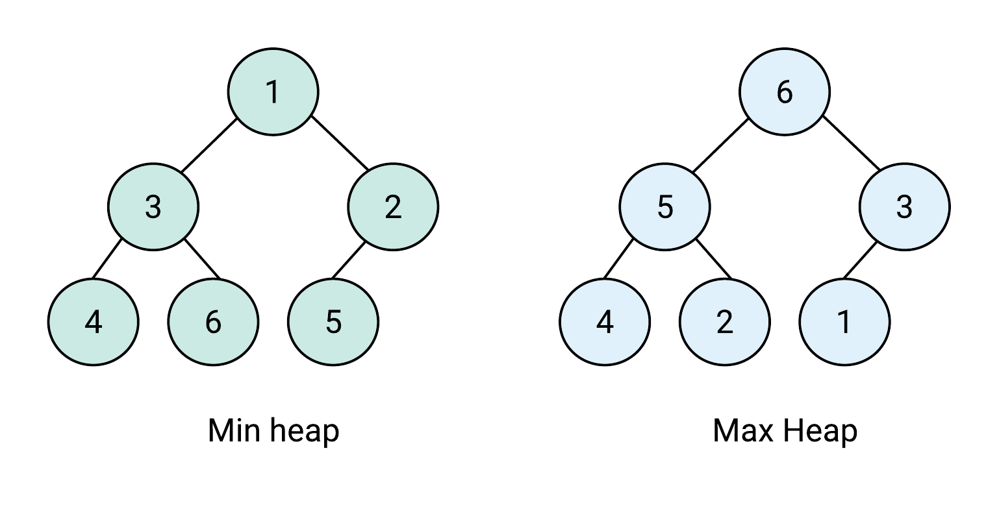

NOTE: 
- Heaps must always maintain the shape of a complete binary tree. 
- Each call to add will take Θ(log n) time in the worst case.
- The height of a heap with n nodes is ⌈logn + 1⌉. 
- Commonly used in Priority Queues and Heap sort. (Min-heaps for PQ & Max-heaps for Heap sort)
- The root node of a heap is typically at index 1. 

Height of heap: O(log N)

Min/Max Heapify: Used during deletion, operation to restore the heap property after replacing the root with the last element. Operation starts at the root and compares current node with its children, swapping with the smaller/larger child if necessary, and continues this process down the heap.

Bubble-up: Used during insertion. compares the new element with its parent and swaps if necessary, moving up the heap until the property is restored.

Calculate positions:
- Get Node's left child: [left(i) = 2*i]
- Get node's right child: [right(i) = 2*i + 1]
- Get node's parent: [floor (i/2)]

# Minimum-heap
- the value of each node is smaller than or equal to the values of its children.
- the minimum element is always at the root of the heap.

worst-case time complexity for insertion and deletion:
O(log n) where n is the number of elements in the heap. 

## Operations:
### Deletion
To delete the minimum element from a minimum-heap, *extracting the minimum*, we follow these steps:
1. Replace the root node with the last node in the heap.
2. Compare the new root with its children and swap it with the smaller child if necessary.
3. Repeat step 2 until the heap property is restored. (Min-Heapify operation)

The cost of removing the minimum element is Θ(logn) in the average and worst cases.

### Insertion
To insert a new element into a minimum-heap, we follow these steps:
1. Add the new element as the last node in the heap.
2. Compare the new element with its parent and swap them if necessary to maintain the heap property.
3. Repeat step 2 until the heap property is restored. Continue the bubble-up process up the heap.

### Build-Heap
To build a minimum-heap from an unordered array, we follow these steps:
1. Start from the last non-leaf node and apply the heapify operation to each node up to the root.
2. This ensures that all subtrees satisfy the heap property, resulting in a complete heap.

# Maximum-heap
- The value of each node is greater than or equal to the values of its children.
- the maximum element is always at the root of the heap.

worst-case time complexity for insertion and deletion:
O(log n) where n is the number of elements in the heap. 

## Operations:
### Deletion
To delete the maximum element from a maximum-heap, *extracting the maximum*, we follow similar steps as in the deletion operation for a minimum-heap. However, instead of swapping with the smaller child (at the root), we swap with the larger child. Complete the operation with Max-heapify.

1. Replace the root node with the last node in the heap.
2. Compare the new root with its children and swap it with the larger child if necessary.
3. Repeat step 2 until the heap property is restored. (Max-Heapify operation)

The cost of removing the maximum element is Θ(logn) in the average and worst cases.

### Insertion
To insert a new element into a maximum-heap, we follow similar steps as in the insertion operation for a minimum-heap. However, instead of comparing with the parent and swapping if necessary, we compare with the parent and swap if the new element is greater than the parent. Continue the bubble-up process up the heap.

### Build-Heap
To build a maximum-heap from an unordered array, we follow these steps:
1. Start from the last non-leaf node and apply the heapify operation to each node up to the root.
2. This ensures that all subtrees satisfy the heap property, resulting in a complete heap.

Note: The build-heap operation processes nodes in reverse level order, starting from the bottom-most level to the top-most level, and from right to left within each level.

The cost of build heap is the sum of the costs for the calls to siftDown. Each siftDown operation can cost at most the number of levels it takes for the node being sifted to reach the bottom of the tree.
